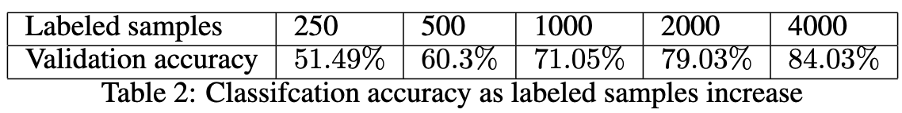
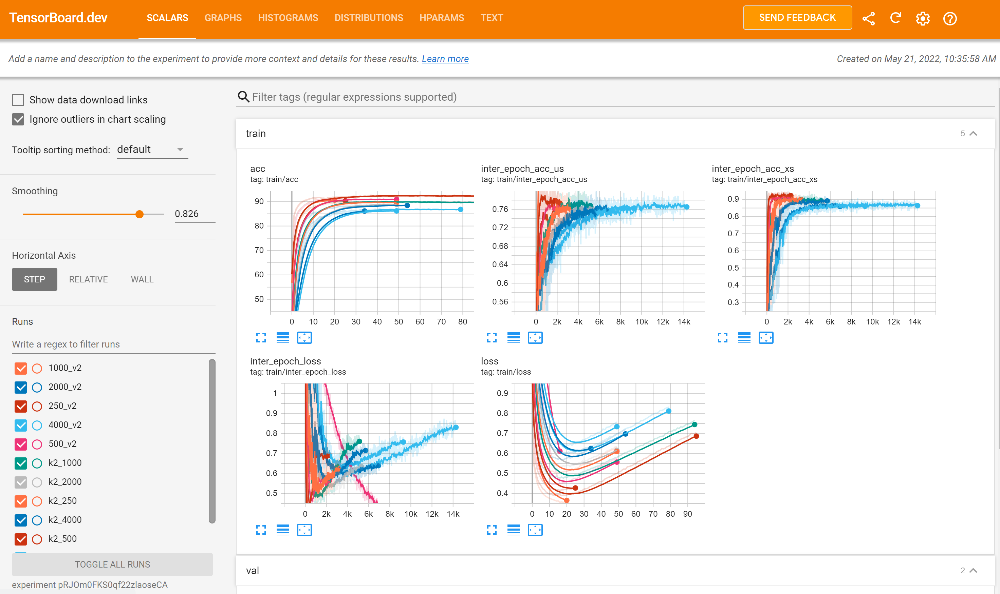
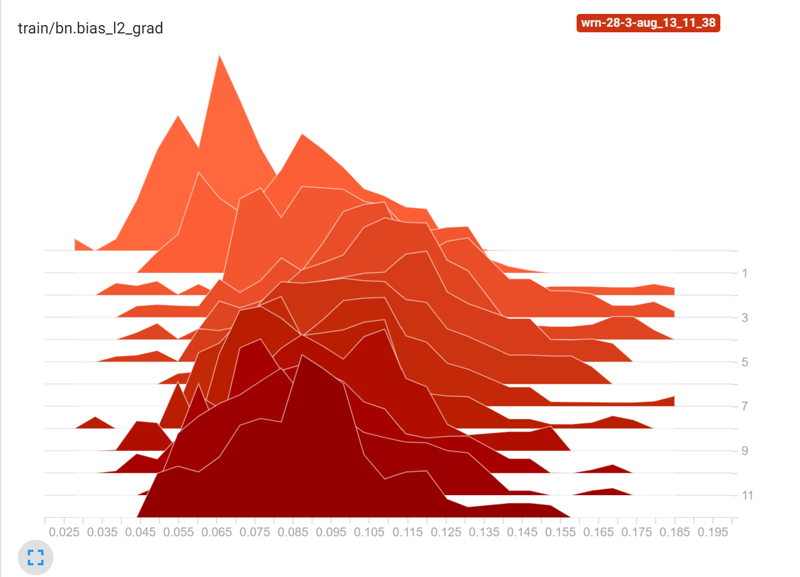
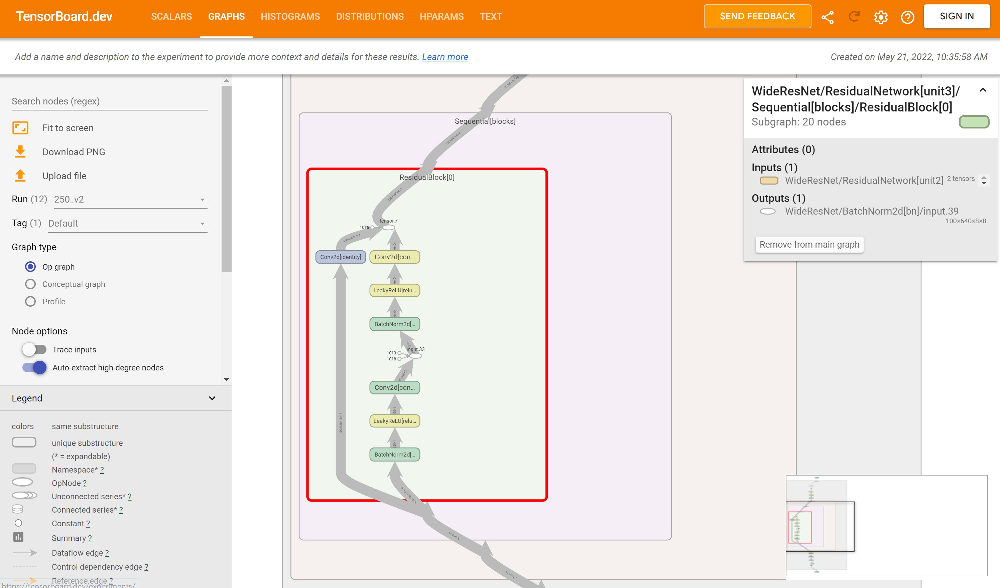
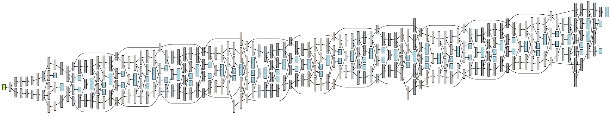

# MixMatch: Implementation of Semi-Supervised Learning on CIFAR-10
[MixMatch](https://arxiv.org/abs/1905.02249) is a high-level algorithm for semi-supervised learning (SSL) that
achieves state-of-the-art results on semi-supervised learning image classification
tasks. 

Its key steps include mixing in unlabeled samples with labeled (MixUp) and
penalizing inconsistent prediction of unlabeled samples. In this work, we reproduce
parts of the key findings of [Google](https://arxiv.org/abs/1905.02249), and also discuss the limitations of the method. 

In particular, we investigate the dependence of the results on the data augmentation
used, the training length, and the unlabeled loss term of MixMatch. We are able
to achieve 90.8% test accuracy on [CIFAR10](https://www.cs.toronto.edu/~kriz/cifar.html) when trained with 4000 labeled and
36000 unlabeled samples.


# Results

Tensorboard shows a view like this:



It also logs gradient values:



And plots the computation graph:



... and another view of the computation graph:




# How To Run

To run (currently set to train a WRN-28-2 on 1000 labeled images for 200 epochs), do
```bash
pip install -r requirements.txt
python src/main.py
```

When running you see text output showing the training progress. Data is also logged to tensorboard, which you can see by doing
```bash
(python -m tensorboard.main ./results) &
sensible-browser http://localhost:6006
```